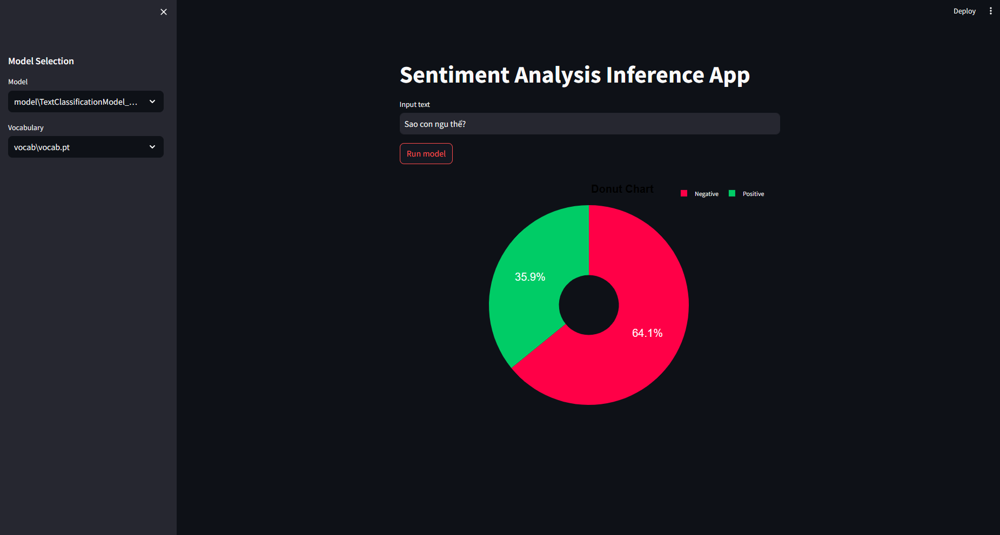

# Text Classification using Neural Network (Torchtext)


In this endeavor, I focused on crafting a Sentiment Text Classification system tailored specifically for the Vietnamese language, employing a straightforward neural network approach. My primary goal was to demonstrate the application of Deep Learning techniques in addressing basic tasks. With this objective in mind, I committed myself to meticulously designing and training the model from the ground up.

**📝Author:**

- **Github:** [EbisuRyu](https://github.com/DSRoAI) 🔗
- **Email:** nhhlong2004@gmail.com 📧
- **Facebook:** [Long Hoang](https://www.facebook.com/hoanglong.roai/) 👤
- **LinkedIn:** [Long Nguyen Huu Hoang](https://www.linkedin.com/in/long-nguy%E1%BB%85n-h%E1%BB%AFu-ho%C3%A0ng-023870287/) 💼

> **If you find this repository helpful, please consider giving it a ⭐️!**

## Table of Contents
* [Setup](#setup)
  * [Environment](#environment)
  * [Pretrained Models and Vocabulary](#pretrained-models-and-vocabulary)
* [Usage](#usage)
  * [Training](#training)
  * [Inference](#inference)
* [Data](#data)

## Setup
### Environment
Using Miniconda/Anaconda: Below is the command line to create a Conda environment using a YAML file.

```
cd path_to_repo
conda env create -f environment.yml
conda activate project_env
```

### Pretrained Model
## Pretrained Models and Vocabulary

All pretrained models are located in the `model` folder 

While pretrained vocabularies can be found in the `vocab` folder.

## Usage
### Training
Before starting training you can either choose a configuration out of available ones or create your own inside a single file `script/config.py`. The available parameters to customize, sorted by categories, are:

- **DIRECTORIES** 

  - 📁 **TRAIN_DIR**: Training data directory
  - 📁 **VALID_DIR**: Validation data directory
  - 📁 **TEST_DIR**: Test data directory

- **PATHS**

  - 💾 **MODEL_SAVE_PATH**: Path to save trained models
  - 💾 **VOCAB_SAVE_PATH**: Path to save vocabulary

- **MODEL PARAMETERS**

  - 📊 **VOCAB_SIZE**: Vocabulary size
  - 💾 **SAVE_EPOCH**: Save model after every n epochs
  - 📝 **LOG_INTERVAL**: Log interval for printing training progress
  - 📦 **BATCH_SIZE**: Batch size for training
  - 📈 **LR**: Learning rate

- **MODEL ARCHITECTURE**

  - 🌐 **EMBED_DIM**: Embedding dimension
  - 🔍 **HIDDEN_DIM**: Hidden dimension
  - 🔢 **NUM_CLASS**: Number of classes (Negative and Positive)

- **DEVICE**

  - 💻 **DEVICE**: Device to run the model on (e.g., 'cpu', 'cuda')


Once you decide on the configuration edit the config name in main.py and do:
```
$ cd script
$ python main.py
```

### Inference
To facilitate inference, I've developed a straightforward application using Streamlit, which operates directly within your browser. Prior to using the app, ensure that you've either trained your models or downloaded pretrained ones. The application automatically searches the model directory for checkpoints of both the model and the vocabulary.
```
$ cd script
$ streamlit run inference_app.py
```


## Data

### Description

This dataset contains Vietnamese text data classified into two sentiment classes: "Negative" and "Positive." It is tailored for sentiment analysis or classification tasks in the Vietnamese language. The dataset is structured into two main folders:

- **data_train**: This folder contains the training data used for model development.

- **data_test**: This folder comprises the testing data utilized to evaluate model performance.

Each data instance within the dataset is labeled with its corresponding sentiment class, enabling the application of supervised learning techniques for sentiment analysis or classification tasks.

The data originates from blogs hosted on the website: [StreetCodeVN](https://streetcodevn.com/).
#### Folder Structure
```
|__ data_train
|     |
|     |__ train
|     |     |__ pos
|     |     |__ neg
|     |
|     |__ test
|           |__ pos
|           |__ neg
|
|__ data_test
      |
      |__ test
            |__ pos
            |__ neg
```

### Data Instance

#### Positive:
```
Xe_đẩy bán cơm_chiên nằm ngay đầu đường vào khu dân_cư metro , chạy từ ngoài vô là xe thứ_hai nhé . Mình hay mua cơm của chị này lắm , cơm_chiên mềm , nóng_ăn chung với trứng chiên , lạp_xưởng , thịt heo và chà bông nên vừa ăn lắm mà có thêm dưa_leo và cà_chua nên ăn_không ngán , ăn xong hợp cơm là bao no đến trưa . Giá chủ có 10/1 hộp à . Buổi_sáng rất đông người ghé mua , vì bán vừa ngon vừa rẻ lại ăn rất no . Tuy đông nhưng chị làm nhanh lắm mà nói_chuyện với khách cũng vui_vẻ lịch_sự nữa nên lần nào đi ngang buổi_sáng là ghé mua hoài à .
```

#### Negative:
```
Mua có mỗi Bingsu thập_cẩm 45k mà mình f đợi hơn 20 ' . Hỏi lại thì nv tl có r nhg bảo chờ thêm 15 ' nữa " tụi e lm liền " .
Mình k biết có ngon k nhg cũng muốn ăn thử . Thiết_nghĩ nv quán nên xem_lại cách pv và nc vs khách .

```